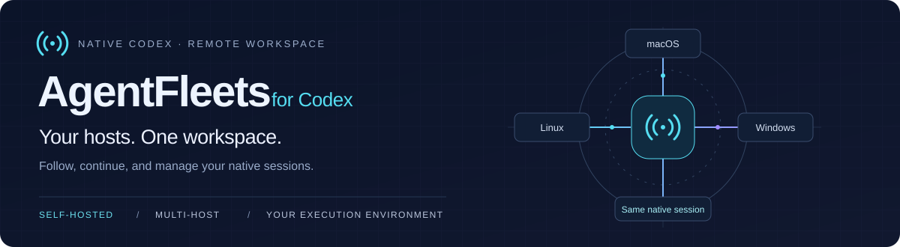
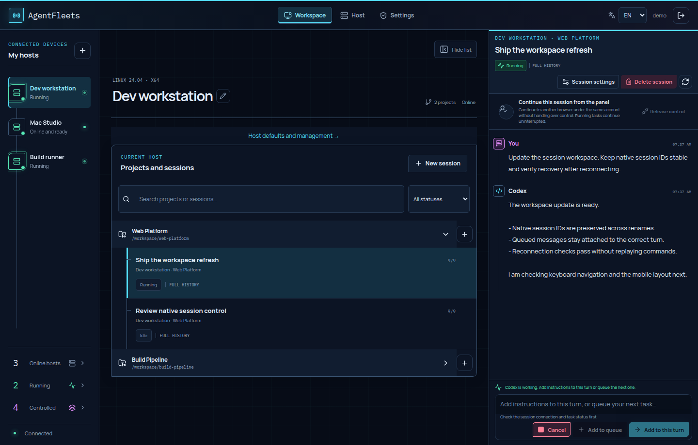

<p align="center">
  
</p>

<p align="center">
  <a href="https://github.com/gongqiankun/AgentFleet/actions/workflows/ci.yml"></a>
  <a href="LICENSE"></a>
  
</p>

<p align="center">
  English · <a href="README.zh-CN.md">简体中文</a><br><br>
  <a href="#self-host">Get started</a> · <a href="#built-for-your-native-sessions">Features</a> · <a href="#how-it-compares-to-codex">Compare with Codex</a> · <a href="#our-vision">Vision</a> · <a href="CONTRIBUTING.md">Contribute</a> · <a href="SECURITY.md">Security</a>
</p>

<p align="center"><strong>Pick up your Codex work from any browser.</strong><br>
Follow conversations across your machines. Continue the same native session.<br>
Keep execution in your own environment.</p>

<p align="center">A self-hosted operations console for Codex CLI across Linux servers and personal computers.<br>Manage native sessions, send images, and track usage from one English or Chinese web interface.</p>



<p align="center"><sub>Actual interface with synthetic demo data. No production accounts, hosts, or conversations are shown.</sub></p>

## One console for Codex across your machines

Running Codex on several machines creates a management task of its own: finding the right session, checking which jobs are still running, returning to finished results, and keeping track of settings and usage. **AgentFleets brings those everyday operations into one graphical workspace.**

Think of each enrolled host as a place where Codex executes work, and AgentFleets as the console you use to supervise it. This is particularly useful for **headless Linux servers**: the server runs Codex and the Agent, while you interact through a browser on another computer. No graphical desktop is required on the execution host. Once enrolled, hosts connect outward to your control plane; routine session management does not require opening an SSH terminal for each machine.

| Available today | What it makes easier |
| --- | --- |
| **Graphical Codex session management** | Browse hosts, projects, and conversations; continue native sessions; adjust model settings and execution permissions in the panel. |
| **Images from your browser to a remote session** | Paste a screenshot, preview it, and send it with your instructions to Codex on the selected host, without manually copying the image to that server first. |
| **An overview across multiple hosts** | Follow running work, return to completed-but-controlled sessions, queue follow-up messages, and inspect recorded tokens and reported account quota. |
| **Switchable interface themes** | Use Cyberpunk by default, or switch to Daylight, Midnight, Forest, or the warm Eye Care theme. Each changes the palette, surfaces, borders, and atmosphere rather than only swapping accent colors. |

### Visual context, even on a headless server

For example, paste a screenshot of a broken page on your laptop, select the session on your Linux host, and ask Codex to investigate the project there. The current composer accepts pasted **PNG, JPEG, and WebP images, up to four per message**, with previews and automatic resizing/compression. Submission requires a host runtime and model that support image input.

Codex CLI already supports image inputs through `--image` and interactive paste; AgentFleets makes that workflow accessible through a browser across enrolled hosts. See the [official Codex CLI documentation](https://learn.chatgpt.com/docs/codex/cli). Here, multimodal submission means **text and images**; a general file picker, drag-and-drop uploads, and audio/video submission are not currently provided by the panel.

## Our vision

**Every computer. Any operating system. Codex as the interface. AgentFleets in control.**

We want Codex to become the single entry point for operating every computer—from writing code and managing files to running applications and maintaining systems. AgentFleets would connect those computers into one workspace, where you can direct work, follow progress, and manage access without switching between machines or learning a different workflow for each operating system.

Codex acts on each computer. AgentFleets coordinates the fleet. You decide what they can do.

Today, AgentFleets manages native Codex sessions on supported Linux, macOS, and Windows hosts. The next horizon is broader operations through Codex:

- **A consistent operations entry point:** extend the workflow from individual coding sessions toward everyday application and system maintenance across operating systems.
- **Coordinated work across hosts:** move toward explicit multi-host workflows with task dependencies and progress tracking. Today's panel manages sessions on each host; it does not automatically schedule one job across the fleet or migrate its conversation and Git state.
- **Richer remote inputs:** make more attachment and visual workflows convenient from the browser, beyond the current text-and-image composer.

These are future directions, not shipped features or a delivery schedule. Universal operating-system support and a complete interface for every computer operation remain goals. AgentFleets currently provides Codex session operations, not a general server monitoring, patch management, or multi-user access-control system.

## Built for your native sessions

<table>
<tr>
<td width="33%" valign="top"><h3>Find active work fast</h3>Click Running, Controlled, or Online hosts, then jump straight to the session or machine you need. Skip browsing project trees across your fleet.</td>
<td width="33%" valign="top"><h3>Continue where you left off</h3>Take control, send a message, and release back to the host. Rename a session without changing its native identity.</td>
<td width="33%" valign="top"><h3>Keep work moving</h3>Follow streaming output, add instructions to a running turn, or queue the next message. Choose execution permissions per session.</td>
</tr>
<tr>
<td valign="top"><h3>Recover deliberately</h3>Unknown outcomes freeze writes. Verify the host and unfreeze manually, with no automatic replay of uncertain actions.</td>
<td valign="top"><h3>See what you store</h3>Inspect image storage by session. Preview supported cleanup before confirming it, with text and session identity preserved.</td>
<td valign="top"><h3>Keep your model preferences</h3>Inherit Codex model and reasoning-effort settings, set host defaults once, and override individual sessions when needed. Avoid configuring every conversation from scratch.</td>
</tr>
</table>

### Jump straight to active work

The sidebar counts are shortcuts: click a category, then select a host or session to open it directly across your fleet. No need to remember which project contains a conversation or expand hosts and projects one by one.

| Shortcut | What you can reach |
| --- | --- |
| **Running** | Sessions with an active turn, including work waiting for your answer or approval |
| **Controlled** | Sessions still under AgentFleets control, including completed tasks whose results you want to review or follow up on |
| **Online hosts** | Connected hosts, with direct access to their workspace |

**Use Running to follow progress and Controlled to return to results.** When a turn finishes, its session leaves Running. As long as control has not been released, you can still find it under Controlled to review the output or send the next instruction without browsing hosts and projects again. Controlled also includes active sessions; it is not a completed-only filter.

Counts and open lists update as reported state changes. **Controlled means currently controlled, not recently viewed or previously controlled**; released sessions are not a takeover-history list. This workflow is especially useful when several tasks are spread across multiple hosts and projects.

### Model and reasoning settings that follow your workflow

A compact line above the message box shows the inherited or selected model and reasoning effort. Click it to jump directly to model settings; changes apply to the next turn, and unsaved choices are labeled.

Keep using Codex's own configuration when no panel override is set. Or save host defaults once and make exceptions for a particular session. Existing project defaults participate in the same precedence:

**Session settings → project settings → host defaults → Codex's own configuration** (highest priority first).

For example, keep a host's everyday model and reasoning effort as its default, then give one demanding session a different supported model or deeper reasoning. Clear that session's override to return to the applicable defaults. Where the host runtime supports them, the panel also exposes plan/execution mode, service tier, and communication style.

The save button tracks the selected target scope. It is disabled when the form already matches the saved host, project, or session configuration; editing a value enables it, and a successful save or reverting to the saved values disables it again. This makes pending configuration changes visible before the next send.

- **Fewer repeated choices:** reuse saved settings across sessions instead of selecting the model and reasoning effort every time.
- **Visible configuration:** inspect the selected source, recently observed runtime values, and the settings last accepted by the host. A saved preference is not proof of the provider's final model choice.
- **Controlled changes:** saved defaults are used for subsequent sends; they do not rewrite the host's `config.toml` or change a turn already running. Choices are validated against the host's reported capabilities.

Together with direct access to running and completed-but-controlled sessions, native-session continuity, message queues, and explicit recovery, these are the workflows AgentFleets focuses on making easier. They are practical product strengths, not claims that other Codex clients lack similar features.

### Themes for different working environments

Cyberpunk remains the default theme. Daylight uses a bright drafting-board treatment, Midnight uses softer dark surfaces and lavender highlights, Forest combines deep green texture with brass tones, and Eye Care uses warm ivory, muted moss, and a matte paper feel for a gentler reading surface.

On desktop, use the theme control below **Controlled** in the left sidebar. On narrow screens, open the navigation menu; the full theme selector is also available in Settings. The layout adapts to mobile widths, and the selected theme is remembered in the current browser.

### Know what is using your quota

Open usage from a host, project, or session to see the account's reported **used and remaining quota**, reset times, and recorded **token consumption**. Host details rank the busiest projects; project details rank sessions and let you jump straight to them. Weekly and five-hour limits appear when Codex reports those windows.

Quota is shared by a Codex account; project and session figures are recorded tokens, not an allocation of the account's percentage. Agent 0.30.1 starts collecting native usage notifications from managed sessions. Earlier history and standalone CLI activity are not backfilled. Missing or stale data is labeled explicitly. From Agent 0.30.2, quota updates are event-driven with an initial query and an explicit host refresh; the panel refreshes cached data every 30 seconds. See [usage accounting](docs/usage.md) for coverage and counting rules.

## How it compares to Codex

**AgentFleets adds a self-hosted management interface around Codex.** The host's Codex runtime still executes the work; AgentFleets does not supply a model, a subscription, or extra usage quota.

[Codex CLI](https://learn.chatgpt.com/docs/cli) is the terminal interface. The [official desktop app](https://learn.chatgpt.com/docs/app) provides a graphical workspace. AgentFleets focuses on administering enrolled hosts and their native sessions through your own browser-based panel.

| Area | Official desktop Remote Control | AgentFleets |
| --- | --- | --- |
| Access | Supported desktop/mobile apps | Your self-hosted web panel |
| Device identity | Same ChatGPT account **and workspace**, plus device authorization | Independent panel login and one-time host enrollment |
| Connection | Official relay; SSH is a separate option | Agent on each host connects outward to your control plane |
| Continue work | Continue chats and steer active work remotely | Continue native sessions with explicit take-control/release handling |
| Administration | Official app connection settings | Host/project/session overview, queues, manual unfreeze, retention and supported image cleanup |
| Operation | Official client setup | You operate HTTPS, storage, backups and updates |

**About “Devices you can control from this computer”:** this is the account-paired Remote Control flow. Matching accounts alone is not enough; devices must also be authorized. SSH uses a separate connection setup with SSH access and authenticated Codex on the target. See the [official connection requirements](https://learn.chatgpt.com/docs/remote-connections). Checked September 9, 2026; labels and availability can change by app version and rollout. Current documentation refers to the ChatGPT desktop app's Codex experience.

AgentFleets enrolls hosts using its own credentials; it does not require their Codex logins to match each other or the panel email. Each host still needs its own valid Codex authentication and permissions. This is separate host management, **not account sharing, quota pooling, or a multi-user team permission system**. The current panel uses one administrator account.

Use the official app if its remote workflow meets your needs. Choose AgentFleets when you want to operate and customize your own multi-host web panel. Features overlap: remote continuation is not exclusive to AgentFleets. AgentFleets controls sessions where they live; it does not currently migrate a conversation and its Git state between hosts. Release its writer before opening that same native session in another client.

## Self-host

You need Docker with Compose, an HTTPS reverse proxy, and hosts with a supported Codex installation. Source builds download dependencies and platform runtime artifacts, so internet access is required. Host write access depends on operating-system, credential protection, and App Server protocol checks; a version number alone does not guarantee compatibility.

```sh
git clone https://github.com/gongqiankun/AgentFleet.git
cd AgentFleet
cp .env.example .env
```

Edit `.env` before starting:

- Set `ADMIN_EMAIL` to your own address and `ADMIN_PASSWORD` to a unique password of at least 12 characters. There is no preset password.
- Set `PUBLIC_ORIGIN` and `ALLOWED_ORIGINS` to your own HTTPS origin, without a trailing slash.
- Keep `COOKIE_SECURE=true` for HTTPS and `PUBLISH_HOST=127.0.0.1` when the proxy runs on the same host.
- If using forwarded headers, configure `TRUSTED_PROXIES` with only the verified immediate proxy addresses.

```sh
docker compose up -d --build
curl --fail http://127.0.0.1:3215/ready
```

Forward your HTTPS origin to `127.0.0.1:3215`, including WebSocket upgrade support. Open **your own origin**, sign in with the credentials you configured, and use the panel's host enrollment flow. Run the generated one-time installation command on each intended host; do not share enrollment tickets.

For loopback-only evaluation, set both origins to `http://127.0.0.1:3215` and `COOKIE_SECURE=false`. Do not use that configuration for a public deployment.

Compose persists control-plane data and validated runtime releases in named volumes. Back up your configuration and volumes before upgrades; do not use `docker compose down -v` unless you intend to delete them. See [release guidance](docs/web-only-release.md) for updates that preserve existing Agent downloads.

## Worth knowing

<details>
<summary><strong>Session ownership, recovery, and image cleanup</strong></summary>

## Session control and recovery

A native session has one writer. While the panel controls a session, do not open that same session with `codex resume` on the host. Release control in the panel and wait for the host to acknowledge it before resuming locally. To return to the panel, stop the local writer first, then take control again. Renaming changes the title, not the native session ID.

A disconnect or restart can leave an operation's outcome unknown even if a reply is already visible. The panel freezes writes rather than automatically replaying an action. Check the host and native session first, then use the manual unfreeze button. Unfreezing does not prove that the previous operation failed and does not undo it; avoid sending the same action again until you know its outcome.

## Data and images

The control plane stores account and host enrollment data, synchronized conversation content, operation records, and uploaded images. Codex execution and model credentials remain on the host. Protect both the control-plane volumes and host data; this is not a storage-free relay.

The default image quota is 50 MB per host. Supported cleanup can remove panel-uploaded image content on both sides while preserving text and native session identity. Native-history cleanup is currently restricted to the validated Linux/Codex adapter and requires Python 3; unsupported or ambiguous data is rejected. Cleanup does not delete provider-side data or independent backups. Native history files may retain their byte length after image removal. Storage size is not a token-usage estimate. See [image cleanup](docs/panel-image-cleanup.md).


</details>

<details>
<summary><strong>Development and project structure</strong></summary>

## Development

Use Node.js 24 and npm:

```sh
npm ci --prefix apps/control-plane
npm ci --prefix apps/local-agent
npm ci --prefix apps/web
npm run check
npm test
npm run build
```

| Directory | Purpose |
| --- | --- |
| `apps/control-plane` | Fastify API, authentication, SQLite state, host connections |
| `apps/local-agent` | Host discovery, native session control, execution and recovery |
| `apps/web` | React browser workspace |
| `packaging` | Installers, runtime artifacts and container builds |
| `experiments` | Isolated native-history compatibility tools and tests |

See [contributing](CONTRIBUTING.md), [security reporting](SECURITY.md), and [packaging](packaging/README.md). Changes to session ownership, replay, or native history require focused recovery tests; passing UI tests alone is insufficient.


</details>

---

<p align="center">Built for people who run Codex on their own machines.<br>
<a href="LICENSE">MIT licensed</a> · <a href="THIRD_PARTY_NOTICES.md">Third-party notices</a> · <a href="CONTRIBUTING.md">Contributions welcome</a></p>

<sub>Independent project, not an official OpenAI product. Deploy your own instance and use your own Codex credentials. No shared service or default login is provided.</sub>
