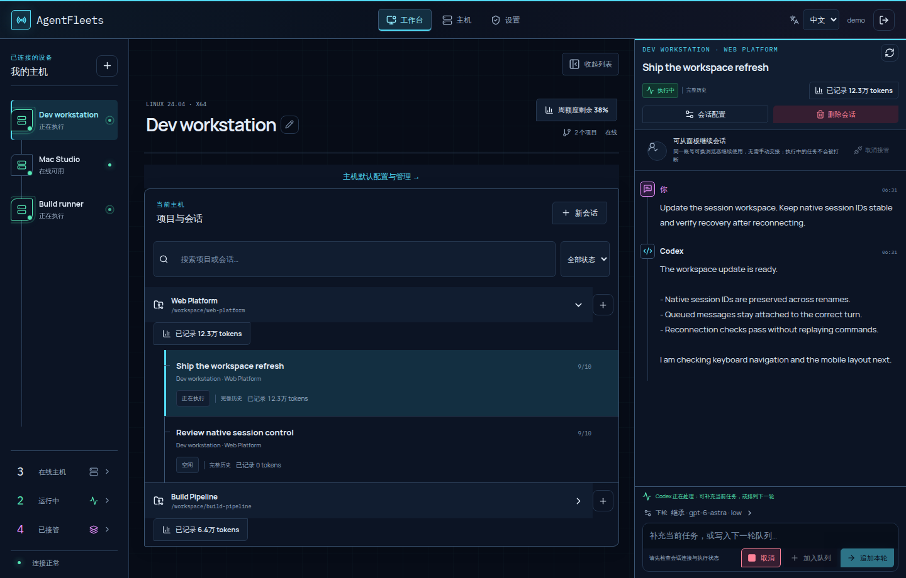

<p align="center">
  
</p>

<p align="center">
  <a href="https://github.com/gongqiankun/AgentFleet/actions/workflows/ci.yml"></a>
  <a href="LICENSE"></a>
  
</p>

<p align="center">
  <a href="README.md">English</a> · 简体中文<br><br>
  <a href="#自行部署">开始使用</a> · <a href="#围绕原生会话构建">功能一览</a> · <a href="#与-codex-有什么区别">与 Codex 对比</a> · <a href="#我们的愿景">愿景</a> · <a href="CONTRIBUTING.md">参与贡献</a> · <a href="SECURITY.md">安全报告</a>
</p>

<p align="center"><strong>打开浏览器，接着做你的 Codex 工作。</strong><br>
统一查看多台主机的对话，继续同一个原生会话。<br>
任务始终在你自己的环境中执行。</p>

<p align="center">自行部署的 Codex 网页控制台，支持远程控制与多主机会话管理。<br>提供中文和英文界面。</p>



<p align="center"><sub>真实产品界面，使用虚构演示数据，不包含生产账号、主机或会话。</sub></p>

## 我们的愿景

**每一台电脑，无论什么系统，都以 Codex 为统一操作入口，由 AgentFleets 统一连接、调度和管理。**

我们希望，从编写代码、管理文件，到使用应用、维护系统，都可以通过 Codex 完成。AgentFleets 将这些电脑连接成一个工作台，让你在一处下达任务、查看进度和管理权限，不必反复切换设备，也不必为不同操作系统学习另一套操作方式。

Codex 负责在每台电脑上执行，AgentFleets 负责统筹所有电脑，而你决定它们可以做什么。

这是项目的长期方向。目前 AgentFleets 聚焦于受支持的 Linux、macOS 和 Windows 主机上的 Codex 原生会话管理；支持任意操作系统、覆盖电脑上的所有操作，仍是愿景，并非已经实现的能力。

## 围绕原生会话构建

<table>
<tr>
<td width="33%" valign="top"><h3>快速找到当前工作</h3>点击运行中、已接管或在线主机，再选择目标，直接回到对应会话或主机，省去跨项目逐层查找。</td>
<td width="33%" valign="top"><h3>接着原来的会话工作</h3>接管、发送消息，再释放回宿主机。重命名只改变标题，保留原生会话身份。</td>
<td width="33%" valign="top"><h3>让任务继续推进</h3>实时跟进输出，给当前轮次补充指令，或排队下一条消息。按会话配置执行权限。</td>
</tr>
<tr>
<td valign="top"><h3>有把握地恢复</h3>结果不确定时冻结写入。核验宿主机后手动解冻，不自动重放可能产生副作用的操作。</td>
<td valign="top"><h3>看清存储占用</h3>按会话查看图片，先预览再确认受支持的清理。保留文字和原生会话身份。</td>
<td valign="top"><h3>沿用模型与思考深度</h3>继承 Codex 的模型和推理强度，统一设置主机默认值，再按会话单独调整，不必为每段对话重复配置。</td>
</tr>
</table>

### 快速回到正在推进的工作

左侧状态计数也是快捷入口：点击分类，再选择对应主机或会话，就能直接进入。任务分散在多台主机、多个项目时，不必记住对话在哪个项目，也不必逐层展开查找。

| 快捷入口 | 可以找到什么 |
| --- | --- |
| **运行中** | 存在活动轮次的会话，包括等待你回答或确认的任务 |
| **已接管** | 当前仍由 AgentFleets 接管的会话，尤其是已经执行完成、需要查看结果或继续追问的会话 |
| **在线主机** | 当前已连接的主机，可直接进入对应工作台 |

**运行中看进度，已接管找结果。** 任务完成后会退出“运行中”；只要没有释放接管，就仍可从“已接管”快速找回，检查执行结果或继续发送下一条指令，无需重新翻找主机和项目。“已接管”也包含仍在运行的会话，并非仅显示已完成任务。

计数和已打开的列表会随上报状态更新。**“已接管”表示当前仍在接管，不是“最近访问”或“曾经接管”**；释放后的会话不会作为接管历史留在这里。这让跨主机、多任务之间的切换更直接，把查找会话的时间留给处理任务。

### 模型与思考深度，按工作习惯继承

输入框上方以紧凑单行显示继承或选定的模型与推理强度，点击即可直接定位模型配置。修改用于下一轮，未保存的本次选择会明确标注。

没有设置面板覆盖时，沿用 Codex 自身配置；也可以为主机统一保存默认值，再为特定会话单独调整。已有的项目配置同样参与继承，优先级从高到低为：

**会话配置 → 项目配置 → 主机默认 → Codex 自身配置。**

例如，主机保持日常使用的模型和推理强度（思考深度），复杂任务单独选择受支持的模型或更深的推理；任务结束后清除该会话的覆盖，即可恢复适用的默认配置。宿主机运行时支持时，还可选择计划／执行模式、服务档位和沟通风格。

- **减少重复设置：** 保存的配置可在多个会话中复用，不必每次重新选择模型和思考深度。
- **看得清配置来源：** 查看当前选用的配置来源、最近读取的运行时值，以及主机上次接受的设置；保存了偏好不等于已确认供应商最终使用的模型。
- **修改边界明确：** 保存的默认值用于后续发送，不改写宿主机的 `config.toml`，也不改变已经运行的轮次。可选项根据宿主机上报能力校验。

结合“运行中看进度、已接管找结果”、原生会话连续性、消息队列和明确的恢复流程，这些都是 AgentFleets 着重改善的日常操作体验。这些是产品特色，不代表其他 Codex 客户端没有类似能力。

### 知道额度还剩多少，消耗在哪里

从主机、项目或会话打开用量，查看账号上报的**已用比例、剩余额度和重置时间**，以及已记录的 **token 消耗**。主机详情列出消耗最多的项目，项目详情列出消耗最多的会话，并支持直接进入。Codex 返回对应窗口时，会显示周额度和 5 小时额度。

账号额度由同账号共享，项目和会话展示的是已记录 token，不是分摊后的账号额度百分比。Agent 0.30.1 开始采集已接管会话的原生用量通知，不回填接入前历史或独立 CLI 中的请求；未获取和过期数据都有明确提示。Agent 0.30.2 起，额度采用连接时首次查询、原生事件触发更新和手动刷新；面板每 30 秒只读取云端快照。统计范围和计算方式见[用量说明](docs/usage.md)。

## 与 Codex 有什么区别

**AgentFleets 为 Codex 提供自行部署的管理界面。** 真正执行任务的仍是宿主机上的 Codex；本项目不提供模型、订阅或额外使用额度。

[Codex CLI](https://learn.chatgpt.com/docs/cli) 是终端入口，[官方桌面版](https://learn.chatgpt.com/docs/app)提供图形工作台。AgentFleets 侧重用自己的浏览器面板，统一管理已配对主机及其原生会话。

| 对比项 | 官方桌面版 Remote Control | AgentFleets |
| --- | --- | --- |
| 使用入口 | 受支持的桌面端、移动端应用 | 自行部署的网页面板 |
| 设备身份 | 同一 ChatGPT **账号和工作区**，另需设备授权 | 独立面板账号，一次性配对主机 |
| 连接方式 | 官方中继；另有独立的 SSH 连接方式 | 每台主机上的 Agent 主动连接你的控制面 |
| 继续工作 | 远程继续对话、补充当前任务指令 | 继续原生会话，明确接管与释放写入权 |
| 管理重点 | 官方应用的连接设置 | 主机／项目／会话总览、队列、手动解冻、保留策略和受支持的图片清理 |
| 运维责任 | 配置官方客户端 | 自己管理 HTTPS、存储、备份和更新 |

**“可通过此电脑控制的设备”是否要求同账号？** 对账号配对式 Remote Control，是同一账号加同一工作区，还需要完成设备授权；并非登录同账号就自动可用。SSH 属于另一种配置流程，需要 SSH 访问权限和目标主机上的 Codex 认证，不能混为一谈。依据：[官方远程连接说明](https://learn.chatgpt.com/docs/remote-connections)。核对日期：2026-09-09；界面名称和开放范围可能随版本变化，当前官方文档已使用 ChatGPT 桌面应用中的 Codex 入口这一表述。

AgentFleets 用自己的凭据配对主机，不要求各主机的 Codex 登录账号彼此相同，也不要求与面板邮箱相同。每台主机仍须有可用的 Codex 认证及权限。这是独立的主机管理，**不代表账号共享、额度合并或多人团队权限系统**；当前面板使用单一管理员账号。

官方远程功能已满足需求时，直接使用官方应用即可。希望自行掌握部署、定制和多主机网页管理时，再选择 AgentFleets。两者功能有重叠，“远程继续会话”并非本项目独有。AgentFleets 在原主机上管理会话，目前不提供将对话及 Git 状态整体迁移到另一台主机的功能；换其他客户端打开同一原生会话前，需先释放面板写入权。

## 自行部署

需要 Docker、Compose、HTTPS 反向代理，以及安装了受支持 Codex 的宿主机。源码构建会下载依赖和各平台运行时，需要网络访问。写入能力由操作系统、凭据保护和 App Server 协议检查共同决定，不能仅凭版本号判断兼容。

```sh
git clone https://github.com/gongqiankun/AgentFleet.git
cd AgentFleet
cp .env.example .env
```

启动前修改 `.env`：

- `ADMIN_EMAIL` 填自己的邮箱；`ADMIN_PASSWORD` 设置至少 12 位的独立密码，没有预设密码。
- `PUBLIC_ORIGIN` 和 `ALLOWED_ORIGINS` 填自己的 HTTPS 地址，不带末尾斜杠。
- HTTPS 保持 `COOKIE_SECURE=true`；反向代理位于同机时保持 `PUBLISH_HOST=127.0.0.1`。
- 使用转发头时，`TRUSTED_PROXIES` 只配置已核验的直接代理地址。

```sh
docker compose up -d --build
curl --fail http://127.0.0.1:3215/ready
```

将自己的 HTTPS 地址反向代理到 `127.0.0.1:3215`，开启 WebSocket 升级支持。访问自己的地址，用自己配置的账号密码登录，在面板中添加主机，并在目标主机运行生成的一次性安装命令。不要分享配对票据。

仅在本机回环地址体验时，可将两个 origin 都设为 `http://127.0.0.1:3215`，并设置 `COOKIE_SECURE=false`。不要把这套 HTTP 配置用于公开部署。

Compose 使用命名卷保存控制面数据和已验证的运行时。升级前备份配置及数据卷；`docker compose down -v` 会删除数据卷，请勿作为普通升级步骤。仅更新网页的方式见[发布说明](docs/web-only-release.md)。

## 进一步了解

<details>
<summary><strong>会话接管、恢复与图片清理</strong></summary>

## 接管、恢复与冻结

同一个原生会话只能有一个写入进程。面板接管期间，不要在宿主机对同一会话执行 `codex resume`。先在面板释放接管，等宿主机确认后再本地恢复。回到面板前，先退出本地写入进程，再接管。重命名只改变标题，不改变原生会话 ID。

断连或重启可能让操作结果不确定，即使对话中已经出现回复。系统会冻结写入，不会自动重发可能产生副作用的动作。请先核验宿主机及原生会话，再手动点击解除冻结。解冻不代表上一条操作失败，也不会撤销它；确定结果前不要重复发送。

## 数据与图片

控制面保存账号和主机注册信息、同步的对话内容、操作记录和上传图片。Codex 执行及模型凭据保留在宿主机。控制面不是无存储转发器，需要保护控制面数据卷和宿主机数据。

默认图片配额为每主机 50 MB。受支持的清理可删除面板上传图片在两端的对应内容，保留文字与原生会话身份。原生历史清理目前限已验证的 Linux/Codex 适配器，需要 Python 3；不支持或来源不明的数据会被拒绝。不会清理供应商云端数据或独立备份。清理后原生历史文件字节数可能不缩小，存储大小也不等于 token 用量。详见[图片清理说明](docs/panel-image-cleanup.md)。


</details>

<details>
<summary><strong>开发与项目结构</strong></summary>

## 开发

使用 Node.js 24 和 npm：

```sh
npm ci --prefix apps/control-plane
npm ci --prefix apps/local-agent
npm ci --prefix apps/web
npm run check
npm test
npm run build
```

`apps/control-plane` 是 API 与 SQLite 控制面，`apps/local-agent` 是宿主机 Agent，`apps/web` 是 React 工作台，`packaging` 提供安装器和构建脚本，`experiments` 包含隔离的原生历史兼容性工具。

参阅[贡献指南](CONTRIBUTING.md)、[安全问题报告](SECURITY.md)和[打包说明](packaging/README.md)。涉及会话所有权、操作重放或原生历史的修改，需要针对恢复行为进行测试。


</details>

---

<p align="center">为在自己主机上使用 Codex 的开发者构建。<br>
<a href="LICENSE">MIT 开源</a> · <a href="THIRD_PARTY_NOTICES.md">第三方声明</a> · <a href="CONTRIBUTING.md">欢迎贡献</a></p>

<sub>本项目独立开发，并非 OpenAI 官方产品。请自行部署并使用自己的 Codex 凭据；不提供共享站点或默认登录账号。</sub>
